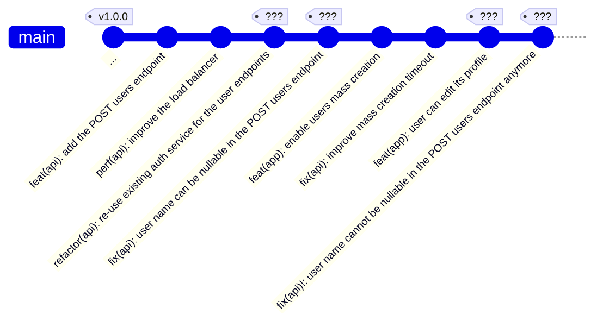

# Conventional Commits
<Hr />

<div class="flex justify-center h-2/5 mt-20">
  
</div>

<p class="text-center">
🤦🤦🤦
</p>

---

<Breadcrumbs />

<br />

<v-clicks>

* **Conventional Commits** est une spécification ajoutant une signification lisible pour l'humain et pour la machine dans les messages des commits.
* Elle fournit un ensemble simple de règles pour créer un **historique de commit explicite**, ce qui facilite l’écriture d’outils automatisés.
* Cette convention suit la convention <Link to="semver" title="SemVer"/>.
</v-clicks>


---

<Breadcrumbs />

## Syntaxe
<Hr />

```
<type>[optional scope]: <description>

[optional body]

[optional footer(s)]
```

<div class="text-xs -mt-4">

**Liste des `type`s:**
<v-clicks>

* `feat` : Une nouvelle fonctionnalité
* `fix` : Correction d'un bug
* `build` : Changements qui affectent le système de build ou les dépendances externes (webpack, maven, npm, ...)
* `ci` : Changements dans nos fichiers de configuration et scripts CI (exemples : Travis, Circle, BrowserStack, SauceLabs)
* `docs` : Changements dans la documentation uniquement
* `perf` : une modification du code qui améliore les performances
* `refactor` : une modification du code qui ne corrige pas de bug et n'ajoute pas de fonctionnalité
* `style` : Changements qui n'affectent pas la signification du code (espaces blancs, formatage, points-virgules manquants, etc.)
* `test` : Ajout de tests manquants ou correction de tests existants
</v-clicks>
</div>


---

<Breadcrumbs />

<br />

<v-clicks depth="2">

* Un commit de type `fix` induit une nouvelle version **PATCH** dans la spécification SemVer.
* Un commit de type `feat` induit une nouvelle version **MINOR** dans la spécification SemVer.
* Un commit dont le `type`/`scope` est suffixé d’un `!`, ou contient dans son `footer` le mot-clé `BREAKING CHANGE:`, introduit un BREAKING CHANGE et induit une nouvelle version **MAJOR** dans la spécification SemVer.
  * Exemple: `feat!: send an email to the customer`
  * Exemple avec un `scope`: `feat(api)!: send an email to the customer`
</v-clicks>

---

<Breadcrumbs />

## Pourquoi l'utiliser?
<Hr />

<v-clicks>

* Générer automatiquement des CHANGELOGs.
* Déterminer automatiquement un changement de version SemVer (en fonction des types de commits inclus).
* Communiquer la nature des changements aux membres de l’équipe, au public et aux autres parties prenantes.
* Déclencher des processus de génération et de publication.
* Faciliter la contribution des personnes à vos projets en leur permettant d’explorer un historique de commit plus structuré.
</v-clicks>

---

<Breadcrumbs />

## Exemple de CHANGELOG
<Hr />

<div class="flex justify-center h-3/5">
  
</div>

---

<Breadcrumbs />

## Exercice
<Hr />

**À vous de jouer:** Donnez les versions des différents tags:


