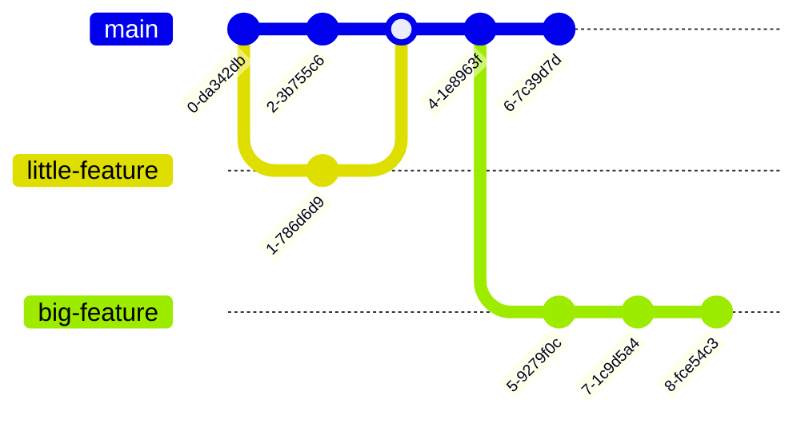
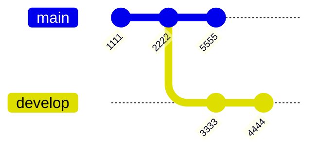
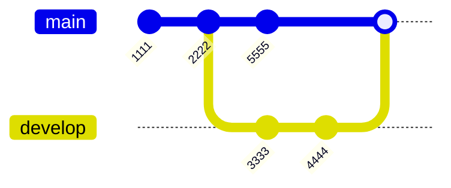
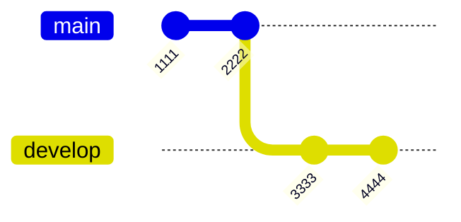
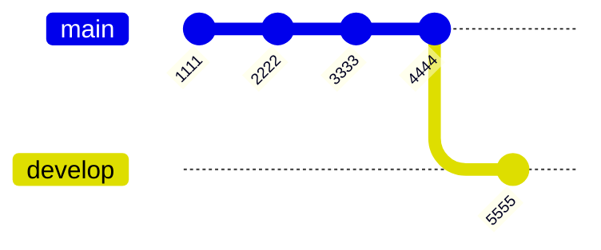

# GIT branching
<Hr />

<div class="flex justify-center h-2/4 p-4 mt-10">
  
</div>

---

<Breadcrumbs />

## Introduction
<Hr />

<v-clicks>

* Une branche représente une ligne de développement indépendante.
* Les branches servent d'abstraction pour le processus d'édition/stage/commit. 
* Vous pouvez les considérer comme un moyen de demander un tout nouveau répertoire de travail, une zone de transit et un historique du projet.
* Les nouvelles validations sont enregistrées dans l'historique de la branche en cours, ce qui entraîne une bifurcation dans l'historique du projet.
</v-clicks>


<v-click>


</v-click>

---

<Breadcrumbs />

<v-clicks depth="3">

* Pour bien comprendre comment Git gère les branches, **il faut se rappeler comment Git stocke ses données**.
* Lors d'un commit, Git enregistre un **objet commit** qui contient un **pointeur** vers le snapshot du contenu que vous avez staggé.
* Cet objet contient entre autre:
  * nom de l’auteur
  * email
  * commentaire de commit
  * pointeurs vers le ou les commit(s) qui ont précédé directement ce commit (son ou ses parents)
    * zéro parent pour le commit initial
    * un parent pour un commit normal
    * plusieurs parents pour un commit résultant d'une fusion de deux branches ou plus.
</v-clicks>

---

<Breadcrumbs />

* **Exemple:** Supposons que vous avez un Working Directory contenant 3 (`README.md`, `LICENCE.md` et `test.rb`) fichiers et que vous les staggiez et commités tous.
* Votre Git Repo contiendra maintenant 5 objets:
  * **3 blobs** chacun représentant le contenu de l’un des 3 fichiers
  * **1 arbre** spécifiant quels fichiers sont stockés en tant que blobs
  * **1 commit** avec le pointeur qui pointe vers cet arbre et toutes les metadonnées de commit

<div class="flex justify-center h-2/4 p-4 mt-10">
  
</div>


---

<Breadcrumbs />

* Si vous faites des changements et commitez à nouveau, les prochains commits enregistreront un pointeur vers le commit qui vient immédiatement avant lui.

<div class="flex justify-center h-2/5 p-4 mt-10">
  
</div>

<br />

<v-click>

**Une branche dans Git est simplement un pointeur léger et mobile vers l'un de ces commits.**
</v-click>

---

<Breadcrumbs />

## Créer une nouvelle branche
<Hr />

<br />

<v-clicks>

* Utiliser la commande `git branch <branch_name>` pour créer une nouvelle branche.
* Cela crée un nouveau pointeur sur le même commit sur lequel on se trouve actuellement.
</v-clicks>

<v-click>
<div class="mt-5 bg-yellow-100 border border-yellow-400 text-yellow-700 px-4 rounded relative text-xs" role="alert">

⚠️ `git branch` crée uniquement la branche mais nous déplace pas dessus.
</div>
</v-click>

---

<Breadcrumbs />

## Switcher sur une branche
<Hr />

Il existe 2 commandes possible pour aller sur une branches:

* `git switch <branch>` (recommandé)
* `git checkout <branch>`

<v-click>

Pour créer directement une branche et s'y déplacer, utiliser:

* `git switch -c <branch>` (recommandé)
* `git checkout -b <branch>`
</v-click>

---

<Breadcrumbs />

## git log --graph
<Hr />


```bash
$ git log --oneline --decorate --graph --all
```

Cette commande affiche l’historique de vos commits, et aussi où sont vos pointeurs de branche et comment votre historique a divergé:

```bash
$ git log --oneline --decorate --graph --all

* 74f5681 (HEAD -> master) Add more cerises
| * 4d23f91 (bbq) Barbecue list
|/
* dc42194 (test) Add the cerises
* 88d904d Add the abricots
* ee3bc50 first commit
```

---

<Breadcrumbs />

## Supprimer une branche locale
<Hr />

* Utilisez la commande `git branch -d <branch>` pour supprimer une branche sans commits.
* La commande `git branch -D <branch>` supprimera une branche qui contient des commits.

---

<Breadcrumbs />

## Renommer une branche locale
<Hr />

* Utilisez la commande `git branch --move <name> <new-name>` pour renommer une branche.

---

<Breadcrumbs />

## Exercice
<Hr />

Nous voulons organiser un barbecue, nous avons donc besoin d'une liste de courses dédiée. Dans votre git repository contenant le fichier `liste-de-courses.txt`:

1. Créez une nouvelle branche `bbq` et ajoutez y le nécessaire
2. Vous avez oublié dans la liste initiale (`main`) une salade. Ajoutez-la dans un commit sans **passez par la Staging Area**.
3. Il semble qu'un anniversaire aura lieu lors de votre barbecue. Créez une nouvelle branche à partir de `bbq` pour y ajouter les idées de cadeaux 🎁.
4. Malheureusement, l'anniversaire est annulé. Supprimez la branche.

<div class="mt-5 bg-yellow-100 border border-yellow-400 text-yellow-700 px-4 rounded relative text-xs" role="alert">

Notez dans votre bloc-notes toutes les commandes utilisées pour la correction.
</div>

<!--
* git commit -a
-->


---

<Breadcrumbs />

## Merger des branches
<Hr />

La commande `git merge <branch>` permet de merger une branche dans la branche actuelle. La commande combinera plusieurs séquences de commits en un seul historique unifié.


<div class="grid grid-cols-2 gap-4 mt-10 items-end">



<div>

`git merge develop`


</div>
</div>

---

<Breadcrumbs />

### Fast forward merge
<Hr />

<v-clicks>

* Par défaut, Git va essayer de merger 2 branches en faisant une fusion en avant rapide (**fast-forwards**).
* Cela est possible lorsqu'il y a un chemin linéaire entre l'extrémité de la branche courante et la branche cible.
* Au lieu de fusionner "réellement" les branches, Git déplace l'extrémité de la branche courante jusqu'à l'extrémité de la branche cible. 
* Il est possible de désactiver cela et d'avoir toujours un merge commit avec l'option `--no-ff`.
</v-clicks>

<v-click>

<div class="grid grid-cols-2 gap-4 items-end">



<div>

`git merge develop`


</div>
</div>
</v-click>

---

<Breadcrumbs />

### Exercice
<Hr />

Nous allons faire des courses:

1. Créez et placez vous sur une nouvelle branche `grocery-shopping`
2. Supprimez des articles dans notre `liste-de-courses.txt`
3. Les courses sont finies: mergez la branche `grocery-shopping` dans `main`
4. Supprimez la branche `grocery-shopping`

<br />

**Question:** Quel est le schéma du git graph une fois ces actions réalisées?

---

<Breadcrumbs />

### Résolution des conflits lors des merges
<Hr />

De temps en temps, **le process de merge ne se passe pas bien** ! Cela se produit quand vous modifiez la même partie du même fichier dans les deux branches que vous voulez merger. Dans ce cas, GIT est incapable de merger et indiquera un **conflit**:

```txt
$ git merge bbq     
Auto-merging liste-de-courses.txt
CONFLICT (content): Merge conflict in liste-de-courses.txt
Automatic merge failed; fix conflicts and then commit the result.
```

---

<Breadcrumbs />

Pour savoir à tout moment quels fichiers n’ont pas été mergé et posent des conflits, utilisez la commande `git status`.

```txt
$ git status
On branch master
You have unmerged paths.
  (fix conflicts and run "git commit")
  (use "git merge --abort" to abort the merge)

Unmerged paths:
  (use "git add <file>..." to mark resolution)
        both modified:   liste-de-courses.txt 🔴
```

---

<Breadcrumbs />

**À vous de jouer:** Mergez la branche `bbq` dans `main` et ouvrez le fichier `liste-de-courses.txt`.

<v-click>

```txt
  * 3 tomates
  <<<<<<< HEAD
  * 2 abricots
  =======
  * 2 abricots
  * 5 cerises
  * 3 saucisses
  >>>>>>> bbq

```
</v-click>

---

<Breadcrumbs />

<div class="text-sm">

* Pour tous les fichiers qui ont des conflits de merge non résolus, GIT ajoute des **marqueurs de conflit** (`<<<<<<<,` `=======,` et `>>>>>>>`) dans les fichiers afin que vous les éditiez et **résolviez les conflits manuellement**.
* En général, le contenu avant le marqueur `=======` est la branche réceptrice et la partie après est la branche de fusion.
</div>

<v-click>

Pour résoudre un conflit, modifiez le fichier impacté pour conserver ce qui est nécessaire tout en supprimant les marqueurs de conflit. **Stagger** ensuite le fichier pour **indiquer à GIT que le conflit est résolu**.

<div class="grid grid-cols-2 gap-4 text-sm">
<div class="flex flex-col">

  **Visualisation du conflit:**

  ```txt
  * 3 tomates
  <<<<<<< HEAD
  * 2 abricots
  =======
  * 2 abricots
  * 5 cerises
  * 3 saucisses
  >>>>>>> bbq
  ```
</div>
<div class="flex flex-col">

  **Résolution du conflit:**

  ```txt
  * 3 tomates
  * 2 abricots
  * 3 saucisses
  ```
</div>
</div>
</v-click>

---

<Breadcrumbs />

**À vous de jouer:** Résolvez le conflit. Quel est le schéma du git graph une fois ce merge réalisé?