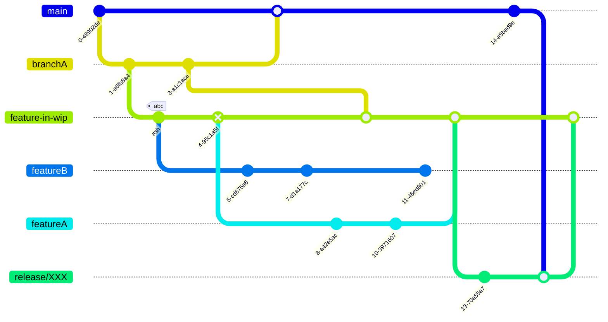

# Git workflow
<Hr />

Dans Git, un modèle de branches peut vite devenir ... chaotique !



---

<Breadcrumbs />

## GitFlow
<Hr />

* GitFlow est un workflow Git existant qui, à l'origine, était une stratégie innovante de gestion des branches Git.
* GitFlow a de nombreuses branches à durée de vie plus longue et des commits plus nombreux. Dans ce modèle, les développeurs créent une **feature branch** et retardent le merge avec la branche principale jusqu'à ce que la fonctionnalité soit terminée.
* GitFlow attribue des rôles très spécifiques à différentes branches et définit comment et quand elles doivent interagir

---

<Breadcrumbs />

<div class="flex gap-5">


<div class="text-sm">
<v-clicks>

* `main`: branche reliée à la mise en production de l'application
* `develop`: branche contenant toutes les features finalisées
* `feature/XXXX`: branches permettant de travailler sur une nouvelle feature
* `release/XXXX`: branches permettant de faire la liaison entre `develop` et `main`
* `hotfix/XXXX`: branches permettant de publier rapidement une correction depuis `main`
</v-clicks>
</div>
</div>

---

<Breadcrumbs />

## Trunk-based development
<Hr />

<v-clicks>

* Dans un workflow de  trunk-based development, tout est basé sur la branche `main`, qui peut être appelée **trunk** et qui signifie tronc (penser à un tronc d’arbre duquel toutes les branches partent)
* Les développeurs créent des feature branches **qui durent peu de temps**, avec peu de commits et mergent très fréquemment de petits changements sur la branche principale.
* Cela assure une grande fluidité même quand la taille de l’équipe et la complexité du code augmentent.
* Afin de déployer une nouvelle version en production, une release branch est tiré du trunk, taguée avec le nouveau numéro de version.
</v-clicks>

---

<Breadcrumbs />

<br />

```mermaid {theme: 'base', scale: 0.8}
---
config:
  gitGraph:
    parallelCommits: true
    showCommitLabel: false
---
gitGraph
  commit
  branch release
  branch feature/name-A
  checkout feature/name-A
  commit
  checkout main
  merge feature/name-A
  checkout release
  merge main tag: "v1.0.0"
  branch feature/name-B
  checkout feature/name-B
  commit
  commit
  checkout main
  commit
  commit
  merge feature/name-B
  checkout release
  merge main tag: "v1.1.0"
```

---

<Breadcrumbs />

## GitFlow vs Trunk-based development
<Hr />

**Quand utiliser Gitflow ?**

<v-clicks>

* Le projet est conséquent
* Le cycle de release est régulier
* La qualité est primordiale
* L'équipe de développement est grande
</v-clicks>

**Quand utiliser trunk-based development ?**

<v-clicks>

* Le project est plutôt récent et de petite taille
* Besoin de délivrer de la feature rapidement
* Les développeurs sont expérimentés
* L'équipe de développement est assez restreinte 
</v-clicks>
