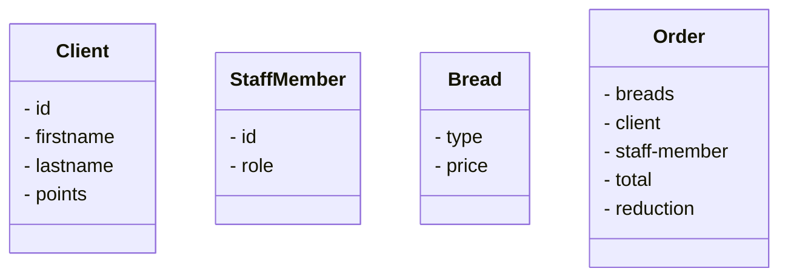

# Définition des API REST
<Hr />

<div class="flex justify-center h-3/4 p-4">
  
</div>

---

<Breadcrumbs />

## Fonctionnement des APIs
<Hr />

* Vous voulez partir en vacances et cherchez toutes les possibilités de vols en avion.
* Pour ce faire, vous vous rendez généralement sur un site de comparaison de vols.

<div class="flex justify-center h-3/5 p-4">
  
</div>

---

<Breadcrumbs />

<br/>

* Finalement, l'avion n'est pas très écologique et les horaires ne sont pas très bons, alors vous essayez de trouver une alternative en train.

<div class="flex justify-center h-3/5 p-4">
  
</div>

---

<Breadcrumbs />

<br/>
<v-clicks depth="2">

* Vous avez facilement accès à des données agrégées sans avoir à rechercher des informations sur le site web de chaque compagnie ferroviaire ou aérienne.
* Vous utilisez et manipulez des données quotidiennement:
  * Informations météorologiques
  * Paiement en ligne
  * Système de cartographie en ligne
  * Les blogs
  * Authentification des utilisateurs (Login with ...)
  * Les réseaux sociaux
</v-clicks>

---

<Breadcrumbs />

Ce partage transparent des données est rendu possible grâce aux interfaces de programmation d'applications (**API**, abréviation de *Application Programming Interface*).

**API:** une façade clairement délimitée par laquelle un logiciel offre des services à d'autres logiciels afin que des données ou des fonctionnalités soient échangées.

<v-click>

<div class="flex justify-center h-2/4 p-4">
  
</div>
</v-click>

---

<Breadcrumbs />

**Exemple:** Application de comparateur de trajets.

<br />

<v-clicks>

* Celle-ci ne peut pas accéder directement aux informations de SNCF, Air France, Blablacar, ...
* Heureusement, ces services fournissent une API qui permet de partager leurs données.
  * Exemple: un trajet Lyon-Bordeaux
* Notre application peut donc appeler toutes ces API avec des paramètres précis et les comparer.
</v-clicks>

---

<Breadcrumbs />

<br />

**Les API peuvent communiquer:**

<v-clicks>

* d’un logiciel à un logiciel
* d’un client à un serveur
* d’un logiciel à des développeurs
</v-clicks>

---

<Breadcrumbs />

**Il existe deux types principaux d'APIs:**

<div class="text-sm">
<v-clicks depth="2">

* **Les API privées**
  * Une API privée permet uniquement aux **utilisateurs autorisés** (salariés d'un entreprise, utilisateurs d'une application) d'être utilisé.
  * **Contrôle**: Les API privées permettent à une organisation d'avoir un contrôle total sur ses données et ses services, car non destinées à la consommation externe.
  * **Personnalisation**: Les API privées peuvent être personnalisées pour répondre aux besoins spécifiques d'une organisation, ce qui lui permet de tirer le meilleur parti de l'API.
  * **Sécurité**: Les API privées offrent le niveau de sécurité le plus élevé, car elles ne sont pas exposées aux menaces externes et peuvent être sécurisées à l'aide de protocoles de sécurité internes.
* **Les API publiques**
  * Une API publique est utilisable par d’autres parties, qu’elles soient sur votre application ou non
  * **Adoption généralisée**: Les API publiques sont accessibles à un large éventail de développeurs, ce qui peut conduire à leur adoption généralisée et à leur utilisation dans un grand nombre d'applications.
  * **Facilité d'utilisation**: les API publiques étant ouvertes à tous, elles sont généralement bien documentées et faciles d'utilisation.
  * **Innovation**: Les API publiques peuvent favoriser l'innovation en permettant aux développeurs de créer de nouvelles applications et de nouveaux services en utilisant les données et les services fournis par l'API.
</v-clicks>
</div>

---

<Breadcrumbs />

**Il existe aussi:**

<v-clicks>

* **Les API partenaires:** interfaces spécialisées qui permettent aux organisations d'accéder aux données et aux offres de services d'autres entreprises (B2B).
* **Les API composites:** regroupement de plusieurs API en une seule interface offrant aux développeurs une vue unifiée des données provenant de différentes sources.
</v-clicks>

---

<Breadcrumbs />

**En résumé:**

<v-clicks>

* Les API permettent de communiquer des données.
* Elles permettent la communication entre différents composants de votre application et entre votre application et d’autres développeurs, par l’utilisation de requêtes et de réponses.
* Elles donnent un moyen d’accès aux données de façon réutilisable et standardisée.
* Les API publiques sont utilisables par tous sans restriction.
* Les API privées sont utilisables seulement par ceux qui ont un accès et y sont autorisés.
</v-clicks>


---

<Breadcrumbs />

## Pourquoi REST?
<Hr />

<v-click>

<div class="flex justify-center h-3/5 p-4">
  
</div>

<div class="text-center text-sm">

Chiffres du [2023 State of the API Report](https://www.postman.com/state-of-api/api-technologies/) de Postman, basés sur un échantillon de 40.000 développeurs.
</div>
</v-click>

<!--
* il existe de nombreuses facons de faire des APIs, pourquoi celle-ci?
* 86% des personnes interrogées ont déclaré utiliser REST
* Nous n'allons pas rentrer dans les détails des autres APIs
-->

---

<Breadcrumbs />

<div class="flex items-center text-sm">

<v-clicks depth="2">

* Le Web a commencé à être utilisé au quotidien en 1993-1994
* Les groupes de travail du W3C ont commencé à travailler ensemble sur la création de descriptions formelles des trois normes principales du Web:
  * **URI:** Uniform Resource Identifier
  * **HTTP:** Hypertext Transfer Protocol, protocole de communication client-serveur 
  * **HTML:** HyperText Markup Language, langage de balisage conçu pour représenter les pages web
* Roy Fielding a participé à la création de ces normes notamment HTTP et URI.
* Il défini **REST** dans sa thèse de doctorat en 2000 intitulée "Architectural Styles and the Design of Network-based Software Architectures"
</v-clicks>

<v-click>
<div class="flex justify-center h-3/5 p-4">
  
</div>
</v-click>

</div>

---

<Breadcrumbs />

<div class="text-center text-3xl mt-40">

**Re**presentational **S**tate **T**ransfer

<div class="text-xs">
(Transfert d’État de représentation)
</div>
</div>

<br />

<v-click>

REST définit un ensemble de contraintes relatives au comportement de l'architecture d'un système hypermédia distribué à l'échelle de l'Internet, tel que le Web.
</v-click>

---

<Breadcrumbs />

## Architecture de REST
<Hr />

Un système ou API **RESTful** utilise le protocole HTTP.

<div class="grid grid-cols-2 gap-10">

<v-click>
<div>

**HTTP request**


</div>
</v-click>

<v-click>
<div>

**HTTP response**


</div>
</v-click>

</div>


---

<Breadcrumbs />


### Contraintes
<Hr />

REST définit 6 contraintes:

<div class="text-sm">
<v-clicks>

* **Client/Server:** Les responsabilités sont séparées entre le client et le serveur.
* **Stateless:** Entre deux requêtes successives, la communication client–serveur s'effectue sans conservation de l'état de la session de communication. Les requêtes du client contiennent donc toute l'information nécessaire pour que le serveur puisse y répondre.
* **Cacheable:** Les clients et les serveurs intermédiaires peuvent mettre en cache les réponses. Les réponses doivent donc, implicitement ou explicitement, se définir comme pouvant être mises en cache ou non.
* **Uniforme Interface:** L'utilisation des mêmes normes est fondamentale dans la conception d'un système RESTful.
* **Layered system:** Un client ne peut généralement pas savoir s'il est connecté directement au serveur final ou à un intermédiaire en cours de route.
* **Code on demand (optionnel):** Les serveurs peuvent temporairement étendre ou modifier les fonctionnalités d'un client en lui transférant du code exécutable (exemple: *applets Java* ou des scripts *JavaScript*).
</v-clicks>
</div>

---

<Breadcrumbs />

Ces contraintes permettent à un système (RESTful) une meilleure:

<v-clicks>

* Performance
* Extensibilité
* Simplicité
* Évolutivité
* Visibilité
* Portabilité
* Fiabilité
</v-clicks>

---

<Breadcrumbs />


### Définitions
<Hr />

Les API REST basées sur HTTP sont définies par:

<v-clicks>

* un **URI** de base, comme `http://api.example.com/v1/collection/`
* des **méthodes HTTP** standards comme `GET`, `POST`, `PUT`, `PATCH` et `DELETE`
* un **type de médias** pour les données permettant une transition d'état comme `application/json`, `application/xml`, `multipart/form-data`
</v-clicks>

---

<Breadcrumbs />

#### Gestion des URIs
<Hr />

Dans une API REST, les données sont représentées par ce qu’on appelle des **ressources** et des **collections**.

<div class="text-sm">
<v-clicks depth="2">

* Une **ressource** est un objet suffisamment important pour être référencé en lui-même. Elle possède 
  * des données, 
  * des relations avec d'autres ressources 
  * des méthodes qui opèrent sur elle pour permettre l'accès et la manipulation des informations associées
  * **Exemple:** un utilisateur (`user`), une localisation (`location`), un personnage (`character`)
* Une **collection** est un groupe de ressources.
  * On s’y réfère avec la forme au **pluriel** du nom de la ressource.
  * **Exemple:** `characters` est une collection de `character`.
</v-clicks>
</div>

---

<Breadcrumbs />

**À vous de jouer:** Vous souhaitez créer une API pour une boulangerie qui vend différents types de pain. Quelles seraient les **collections**, les **ressources** et leurs **informations complémentaires** impliquées dans l'achat d'un pain par un client auprès d'un vendeur ?

<v-clicks>
<div class="flex justify-center mt-10">


</div>

**Collections:** `Clients`, `StaffMembers`, `Breads`, `Orders`
 
</v-clicks>

---

<Breadcrumbs />

En règle générale, il n'existe que deux chemins pour une ressource donnée lorsqu'il s'agit d'un endpoint API RESTful.

<v-clicks>

* `/{collection}`: utilisé pour identifier une collection.
* `/{collection}/{ressource-id}`: utilisé pour identifier une ressource spécifique de cette collection.
</v-clicks>

<br />

<v-click>

Ces chemins peuvent être imbriqués afin de créer une relation entre les ressources:

* `/bakeries/42/clients`
* `/bakeries/42/staff-members/4`
</v-click>
---

<Breadcrumbs />

**Quelques bonnes pratiques:**

<br />

<div class="text-sm">
<v-clicks depth="2">

* Utiliser des noms pour représenter les ressources, **pas de verbes**.
* Les **collections** doivent toujours être **au pluriel**
* Utiliser des **lettres minuscules** dans les URIs
* Utiliser des traits d'union `-` pour améliorer la lisibilité des URIs, ne pas utiliser d'underscores `_`:
  * ❌ `/bakeries/42/opening_hours`
  * ✅ `/bakeries/42/opening-hours`
* Ne pas utiliser d'extensions de fichiers car elles sont peu esthétiques et n'apportent aucun avantage.
</v-clicks>
</div>

<v-click>
<div class="mt-10 bg-yellow-100 border border-yellow-400 text-yellow-700 px-4 py-3 rounded relative text-xs" role="alert">

<mdi-chat-question /> Si on ne peut utiliser de verbes, comment effectuer des actions sur des données avec une API REST?
</div>
</v-click>

---

<Breadcrumbs />

#### Méthodes HTTP
<Hr />

<div class="text-sm">
<v-clicks>

| Mèthode HTTP | Action                                                     | Opération CRUD |
|--------------|------------------------------------------------------------|----------------|
| **GET**      | Permet de lire une ressource                               | READ           |
| **POST**     | Permet de créer une ressource                              | CREATE         |
| **PUT**      | Permet de modifier la valeur d'une ressource               | UPDATE         |
| **PATCH**    | Permet de modifier une partie de la valeur d'une ressource | UPDATE         |
| **DELETE**   | Permet de supprimer une ressource                          | DELETE         |
</v-clicks>
</div>

---

<Breadcrumbs />

**À vous de jouer:** Donnez une URIs RESTful ainsi que son code HTTP permettant de réaliser les actions suivantes:

<div class="text-sm">

* Récupérez la liste des `staff-member` de la `bakery` identifié par `{bakery-id}`:

<v-click>
<div class="-my-3">

➡️ `GET /bakeries/{bakery-id}/staff-members`
</div>
</v-click>

* Supprimez de vos données un membre du staff de la boulangeries identifié `42`:
<v-click>
<div class="-my-3">

➡️ `DELETE /bakeries/42/staff-members/{staff-member-id}`
</div>
</v-click>

* Dans cette même boulangerie ajoutez une nouvelle recette de pain `bread`:
<v-click>
<div class="-my-3">

➡️ `POST /bakeries/42/breads`
</div>
</v-click>

* Un `client` passe commande (`order`) dans une boulangerie:
<v-click>
<div class="-my-3">

➡️ `POST /bakeries/{bakery-id}/clients/{client-id}/orders`
</div>
</v-click>

* Le `client` modifie sa commande ayant l'ID unique `1`:
<v-click>
<div class="-my-3">

➡️ `PUT /orders/1`
</div>
</v-click>

* La boulangerie `42` pert un client, il faut le supprimer:
<v-click>

* ➡️ `DELETE /bakeries/{bakery-id}/clients/{client-id}`
* ➡️ `DELETE /clients/{client-id}`
</v-click>
</div>

---

<Breadcrumbs />

#### Type de médias
<Hr />

Les méthodes HTTP `GET`, `POST`, `PUT`, `PATCH` et parfois même `DELETE` impliquent le transfert de données du client vers le serveur et du serveur vers le client. Mais quel format utiliser ?

<v-click>

REST utilise généralement 3 types de médias HTTP:

* `application/xml`
* `application/json`
* `multipart/form-data`
</v-click>


---

<Breadcrumbs />

##### application/xml
<Hr />

L'E**X**tensible **M**arkup **L**anguage est un métalanguage de **balisage générique**. Sa syntaxe permet de définir différents langages avec pour chacun son vocabulaire et sa grammaire, comme **XHTML**, **RSS** ou **SVG**:

```xml
<breads>
  <bread>
    <type>baguette</type>
    <price>0.95</price>
    <cooking-time>15</cooking-time>
  </bread>
  <bread>
    <type>épeautre</type>
    <price>1.35</price>
    <cooking-time>25</cooking-time>
  </bread>
 </breads>
```
---

<Breadcrumbs />

##### application/json
<Hr />

Le **J**ava**S**cript **O**bject **N**otation (JSON) est un format de données textuel dérivé de la notation des objets du langage JavaScript:

```json
{
  "breads": [
    {
      "type": "baguette",
      "price": 0.95,
      "cooking-time": 15
    },
    {
      "type": "épeautre",
      "price": 1.35,
      "cooking-time": 25
    }
  ]
}
```


---

<Breadcrumbs />

##### multipart/form-data
<Hr />

Le type de média `multipart/form-data` doit être utilisé pour soumettre des formulaires contenant des fichiers, des données non ASCII et des données binaires.

<v-click>

Il est souvent utilisé pour envoyer des images :

`POST /users/{id}/avatar`

<div class="flex h-1/4">
  
</div>
</v-click>

---

<Breadcrumbs />

### Codes d'état des réponses HTTP
<Hr />

La première ligne d'un message de réponse HTTP est la ligne d'état, qui comprend la version du protocole, suivie d'un **code d'état** numérique et de la phrase textuelle associée: 

`HTTP/1.x 200 OK`

<div class="text-sm -mt-3">
<v-clicks>

| Code    | Catégorie         | Description                                                                  |
|---------|-------------------|------------------------------------------------------------------------------|
| **1xx** | Information       | Demande reçue, poursuite de la procédure                                     |
| **2xx** | Succès            | L'action a été reçue, comprise et acceptée avec succès.                      |
| **3xx** | Redirection       | Une action supplémentaire doit être entreprise afin de compléter la demande. |
| **4xx** | Erreur du client  | La demande contient une mauvaise syntaxe ou ne peut être satisfaite          |
| **5xx** | Erreur du serveur | Le serveur n'a pas réussi à répondre à une demande apparemment valide.       |
</v-clicks>
</div>

---

<Breadcrumbs />

<div class="text-sm">
<v-clicks>

| Code    | Message      | Description                                                                         |
|---------|--------------|-------------------------------------------------------------------------------------|
| **200** | OK           | Requête traitée avec succès. La réponse dépendra de la méthode de requête utilisée. |
| **201** | Created      | Requête traitée avec succès et création d’une ressource.                            |
| **202** | Accepted     | Requête traitée, mais sans garantie de résultat.                                    |
| **204** | No Content   | Requête traitée avec succès mais pas d’information à renvoyer.                      |
| **400** | Bad Request  | La syntaxe de la requête est erronée.                                               |
| **401** | Unauthorized | Une authentification est nécessaire pour accéder à la ressource.                    |
</v-clicks>
</div>


---

<Breadcrumbs />

<div class="text-sm">
<v-clicks>

| Code    | Message               | Description                                                                                                                    |
|---------|-----------------------|--------------------------------------------------------------------------------------------------------------------------------|
| **403** | Forbidden             | Le serveur a compris la requête, mais refuse de l'exécuter car  les droits d'accès ne permettent pas d'accéder à la ressource. |
| **404** | Not Found             | Ressource non trouvée.                                                                                                         |
| **500** | Internal Server Error | Erreur interne du serveur.                                                                                                     |
</v-clicks>
</div>

---

<Breadcrumbs />

### Gestion des filtres
<Hr />

* Dans le cadre des APIs, un filtre est un moyen de restreindre une recherche dans une collection de ressources.


<v-clicks>

❓ Comment récupérer une liste des 30 derniers utilisateurs, ou tous les articles contenant le mot `boulangerie` ?

<div class="mt-10 bg-yellow-100 border border-yellow-400 text-yellow-700 px-4 py-3 rounded relative text-xs" role="alert">

<mdi-bulb /> REST n'apporte pas de standard à l'implémentation de filtres dans une requête.
</div>

</v-clicks>


---

<Breadcrumbs />

2 flows sont néanmoins très populaires parmi la plupart des API :

<v-clicks>

* Ajouter les filtres dans le body d'une requête `POST` pour l'utilisation de filtres assez complexes (⚠️ la méthode POST n'est pas **cacheable**).
* Ajouter les filtres via des query strings dans l'URI de la requête:
</v-clicks>

<v-after>

<br />

```text
GET /users?orderBy=desc&perPage=30
```
</v-after>

---

<Breadcrumbs />

Example d'implémentation avec l'API REST de [Strapi](https://docs.strapi.io/dev-docs/api/rest):

* Pagination:

```yaml
#/ Renvoyer que 10 entrées sur la page 1
GET /users?pagination[page]=1&pagination[pageSize]=10
```
<br />

<v-click>

* Filtres:

```yaml
#/ Trouver les utilisateurs dont le prénom est 'John'
GET /users?filters[username][$eq]=John
```

<div class="text-sm mt-10">

Exemple de syntaxe de query strings permettant un filtrage avancé: https://docs.strapi.io/dev-docs/api/rest/filters-locale-publication#filtering.
</div>
</v-click>

---

<Breadcrumbs />

**À vous de jouer:** En suivant la syntaxe d'une API REST Strapi, donnez les requêtes permettant de récupérer:

* Tous les articles contenant le mot `boulangerie` dans son champ `description`.
* Les boulangeries comptant entre 5 et 10 employés (utilisez le champ `employees_amount`).
* Tous les auteurs `authors` dont le `firstName` commence par la lettre `a` ou `b`.

---

<Breadcrumbs />


```yaml {monaco}
#/ Correction


#/ Tous les articles contenant le mot `boulangerie` dans son champ `description`:

#/ Les boulangeries comptant entre 5 et 10 employés (utilisez le champ `employees_amount`):

#/ Tous les auteurs `authors` dont le `firstName` commence par la lettre `a` ou `b`:


#
```

<!--
* `GET /articles?filters[description][$contains]=boulangerie`
* `GET /bakeries?filters[$and][0][employees_amount][$gte]=5&filters[$and][1][employees_amount][$lte]=10`
* `GET /authors?filters[$or][0][firstName][$startsWithi]=a&filters[$or][1][firstName][$startsWithi]=b`
-->